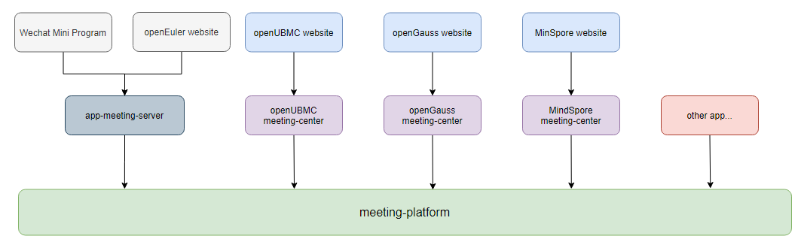
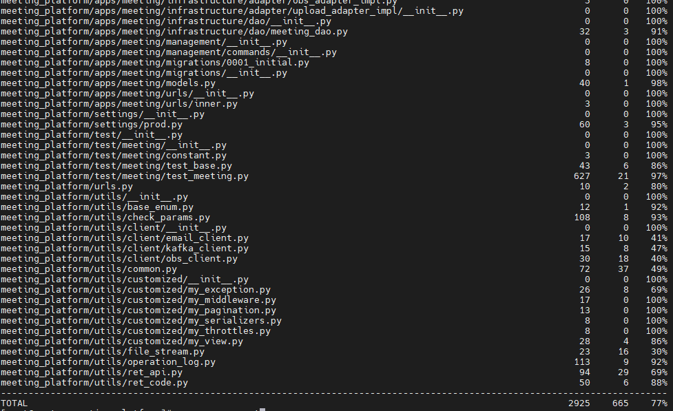

# meeting-platform
### 1.What's here?

Provide a basic meeting platform for various open source communities. Provides the following capabilities： 

+ Provide meeting capabilities, including but not limited to creating, modifying, and deleting meeting.
+ Provide the ability to notify meetings, including via mailing lists or message center.
+ Provide backup of recorded videos and upload to bilibili.

### 2.Use Panorama

### 3.How to use it

#### 1.Install 

~~~bash
yum install -y shadow wget git openssl openssl-devel tzdata python3-devel mariadb-devel python3-pip libXext libjpeg xorg-x11-fonts-75dpi xorg-x11-fonts-Type1 gcc

rpm -ivh https://github.com/wkhtmltopdf/packaging/releases/download/0.12.6-1/wkhtmltox-0.12.6-1.centos8.x86_64.rpm

pip3 install -r requirements.txt
~~~

#### 2.Config

+ Get the config and vault-config template from the [meeting-deploy](https://github.com/opensourceways/meeting-deploy/tree/main/meeting-platform)
+ Replace environment variables with the correct configuration.

+ Set the environment variables for config and vault-config.

  ~~~bash
  export CONFIG_PATH=./deploy/config/config.yaml
  export VAULT_PATH=./deploy/config/vault-config
  ~~~

#### 3.Prepare

~~~bash
python3 manage.py migrate
~~~

#### 4.Test

+ Do test

  ~~~bash
  python3 -m coverage manage.py test --settings=meeting_platform.settings.test
  ~~~

  

+ View code test coverage

  ~~~bash
  python3 -m coverage run manage.py test --settings=meeting_platform.settings.test
  coverage report
  ~~~

  

#### 5.Run

~~~bash
python3 manage.py runserver --noreload
~~~

### 4.Value-added features

1.upload to bilibili and obs.

~~~bash
python3 manage.py handle_recordings
~~~

2.scan the third meeting and upload to bilibili

~~~bash
python3 manage.py scan_upload_meetings
~~~

